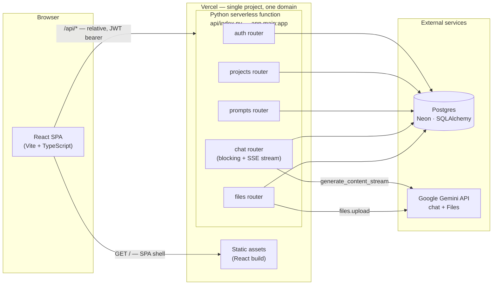
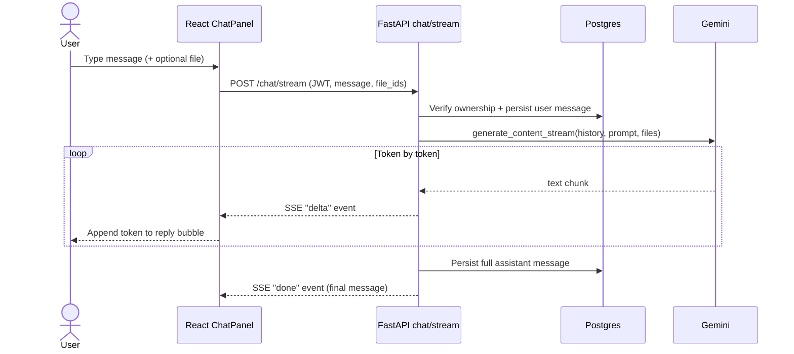
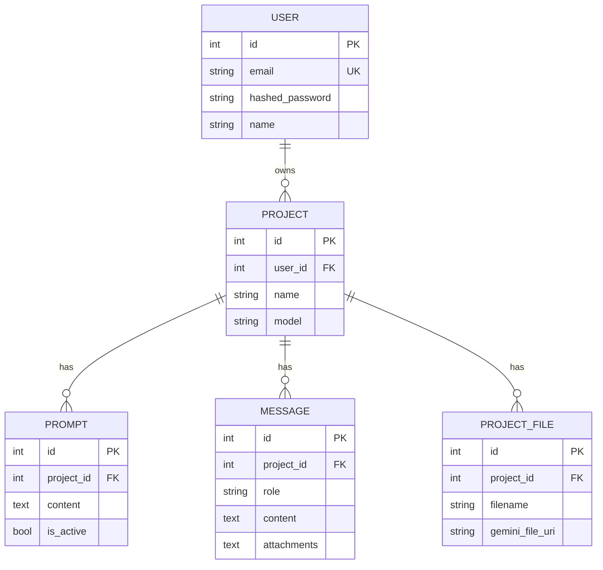

# Architecture & Design Notes

## Overview

Frontend and backend are deployed as a single Vercel project on one domain. The React build is
served as static assets; FastAPI is wrapped as a single Python serverless function
(`api/index.py` → `app.main:app`), with `vercel.json` rewriting all `/api/*` requests to it.
Keeping everything same-origin removes the need for CORS configuration or an explicit API base
URL in the frontend — it just calls `/api/...` regardless of environment, which also keeps local
dev (via a Vite proxy) behaviorally identical to production.

## Streaming chat flow

The chat endpoint streams the model's reply token-by-token so the user sees output almost
immediately instead of waiting for the whole response:

## Data model

- **User** — email, hashed password (bcrypt), name.
- **Project** — an "agent", owned by a user. Holds the model name to use.
- **Prompt** — text associated with a project. Only one `is_active` prompt at a time; new prompts
  deactivate the previous one, and history is preserved for auditability rather than overwritten.
- **Message** — chat turns (`user`/`assistant`) belonging to a project, used both as the visible
  transcript and as the conversation history sent back to Gemini on each turn.
- **ProjectFile** — metadata for files uploaded to the Gemini Files API, linked to a project.

Every project-scoped table is keyed off `project_id`, and every project-scoped endpoint verifies
`project.user_id == current_user.id` before returning or mutating anything — this is the core
tenant-isolation boundary in a single shared database.

## Auth

Email/password with bcrypt-hashed passwords and stateless JWTs (HS256, configurable expiry).
`Authorization: Bearer <token>` is required on every route except register/login/health. Chosen
over OAuth2/third-party SSO because the assignment calls for direct email/password login — JWT
keeps the backend stateless and horizontally scalable, at the cost of not supporting server-side
token revocation (acceptable for a minimal platform; a refresh-token/deny-list scheme would be the
natural next step, see below).

## LLM integration

All Gemini calls go through `app/gemini_client.py`, a single narrow module that the rest of the
app depends on instead of the SDK directly. Chat requests build the conversation from stored
`Message` rows (bounded to the last 20 turns to control latency/cost) plus the project's active
prompt as `system_instruction`. File uploads go straight to the Gemini Files API and only the
returned URI is persisted — the app never stores file bytes itself, which keeps it stateless with
respect to file storage and avoids needing separate blob storage.

Provider errors (missing key, network failure, quota) are caught in the client wrapper and
surfaced as a `502` with a clear message rather than a stack trace — the chat UI shows this and
the user's message stays saved, so a failed LLM call never loses conversation state.

## Non-functional requirements

**Scalability** — FastAPI holds no in-memory session state; every request is authenticated via
the JWT alone, so any number of serverless function instances can serve requests concurrently
without coordination. Postgres is the single source of truth and the natural scaling bottleneck;
connection count is bounded via SQLAlchemy's connection pool with `pool_pre_ping` to survive
serverless cold starts and idle-connection drops.

**Security** — Passwords are bcrypt-hashed, never logged or returned. JWTs are signed
(HS256) with a server-side secret. Every project-scoped resource is ownership-checked
server-side (never trusts a client-supplied user ID). Pydantic validates all input at the
boundary. Uncaught exceptions are caught by a global handler that returns a generic `500` instead
of leaking stack traces or internals to the client.

**Extensibility** — Routers are split by resource (`auth`, `projects`, `prompts`, `chat`,
`files`) so new capabilities (e.g. analytics, another integration) are new modules, not edits to
existing ones. The LLM provider is isolated behind `gemini_client.py`, so swapping to OpenAI/
OpenRouter later touches one file. SQLAlchemy models abstract the DB, so schema changes are
additive migrations rather than app-wide rewrites.

**Performance** — Chat replies are **streamed** token-by-token over Server-Sent Events
(`POST /chat/stream`), so the user sees output begin within a second instead of waiting for the
full response. The backend uses Gemini's `generate_content_stream` and emits SSE `delta` events via
a FastAPI `StreamingResponse`; the assistant message is persisted once the stream completes. Chat
history sent to the model is capped (last 20 turns) to bound latency and token cost as
conversations grow. The frontend also applies optimistic UI updates for sent messages.

**Reliability** — LLM and DB errors are caught and turned into clear HTTP error responses instead
of crashing the process; a failed chat call doesn't lose the user's already-saved message. The app
degrades gracefully without `DATABASE_URL`/`GEMINI_API_KEY` set (falls back to local SQLite; chat
returns a clear 502 instead of failing to start) so misconfiguration is visible and diagnosable
rather than silent.

## Known trade-offs / future work

- **No refresh tokens** — access tokens are long-lived (24h default) rather than short-lived with
  a refresh flow. Simpler for a minimal platform; would add revocation support first if extending
  this toward production.
- **Streaming persists only on completion** — the streamed assistant reply is written to the
  database once, after the stream finishes. If the connection drops mid-stream the partial text
  isn't saved (the user message always is). A blocking `POST /chat` endpoint is also kept as a
  fallback. Verified that Vercel's Fluid Compute flushes the SSE incrementally rather than buffering.
- **No rate limiting** — out of scope for a minimal assignment; would add per-user request
  throttling before any real deployment.
- **Schema managed via `create_all`, not migrations** — fine for this scope; Alembic would be
  introduced alongside the first schema change in a real project. Note that `create_all` only
  creates missing tables, it does not alter existing ones — adding the `attachments` column to
  `messages` after the table already existed on Neon required a manual `ALTER TABLE` during
  development, which is exactly the kind of change Alembic would otherwise track.
