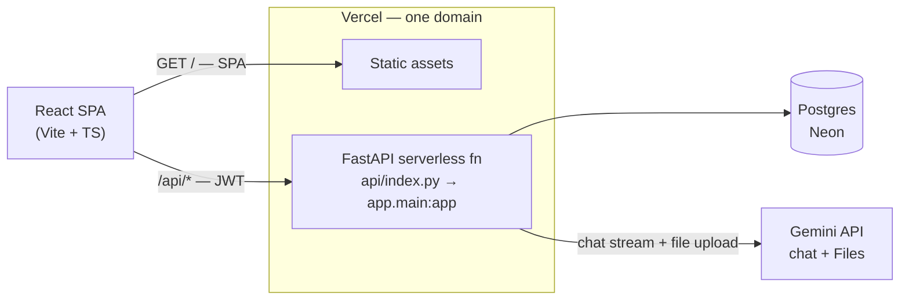

# Demo Chatbot

A minimal multi-user chatbot platform: register/login, create projects ("agents"), attach a
system prompt, chat with Gemini, and upload files for the agent to reference.

Stack: **React + Vite + TypeScript** (frontend), **FastAPI** (backend), **Postgres via SQLAlchemy**
(storage), **JWT** (auth), **Google Gemini API** (LLM + file uploads). Deployed as a single Vercel
project — frontend served statically, backend as Python serverless functions under `/api`.

## Architecture at a glance



See [`ARCHITECTURE.md`](./ARCHITECTURE.md) for the full design write-up, including the streaming
chat sequence diagram and the data-model ER diagram.

## Requirements coverage

Built against the assignment brief; each requirement maps to a concrete part of the codebase:

| Requirement | Status | Where |
|---|---|---|
| Auth (JWT) with registration and login | ✅ | `app/routers/auth.py`, `app/security.py` |
| User accounts | ✅ | `POST /api/auth/register` |
| Login with email + password | ✅ | `POST /api/auth/login` |
| Create a project/agent under a user | ✅ | `app/routers/projects.py` |
| Store and associate prompts with a project | ✅ | `app/routers/prompts.py`, `Prompt` model |
| Chat interface via an LLM (Gemini, chosen over OpenAI/OpenRouter) | ✅ | `app/routers/chat.py`, `app/gemini_client.py` |
| *Good to have:* file uploads into a project (Gemini Files API) | ✅ | `app/routers/files.py`, surfaced in the chat UI's attach button |
| Scalability (multi-user/project, concurrent) | ✅ | Stateless JWT auth, no server-side session state, pooled DB connections |
| Security | ✅ | bcrypt-hashed passwords, JWT-signed tokens, per-request ownership checks, Pydantic input validation |
| Extensibility | ✅ | Modular routers per resource, LLM provider isolated behind `gemini_client.py` |
| Performance (low-latency chat) | ✅ | Chat history capped at 20 turns, optimistic UI updates while awaiting the LLM |
| Reliability (graceful error handling) | ✅ | LLM/DB errors caught and returned as clean HTTP errors, not crashes — see `ARCHITECTURE.md` |

Deliverables checklist from the brief:

| Deliverable | Status |
|---|---|
| Source code in a GitHub repository | ✅ [github.com/yug-sinha/demo-chat-bot](https://github.com/yug-sinha/demo-chat-bot) |
| Instructions to run the application (README) | ✅ This file |
| Brief architecture/design explanation | ✅ `ARCHITECTURE.md` |
| Publicly hosted working demo | ⏳ Not yet deployed |
| Demo recording | ⏳ Not yet recorded |

## Project structure

```
app/                  FastAPI application (routers, models, schemas, auth, gemini client)
api/index.py          Vercel entrypoint that exposes app.main:app
src/                  React frontend
vercel.json           Routes all /api/* requests to the FastAPI function
requirements.txt      Python dependencies
package.json          Frontend dependencies
```

## Prerequisites

- Node.js 18+
- Python 3.11+
- A Postgres database (e.g. [Neon](https://neon.tech), free tier) — optional for local dev, see below
- A Gemini API key from [Google AI Studio](https://aistudio.google.com/app/apikey)

## Environment variables

Copy `.env.example` to `.env` and fill in:

| Variable | Required | Description |
|---|---|---|
| `DATABASE_URL` | No (defaults to local SQLite) | Postgres connection string. Required for production. |
| `GEMINI_API_KEY` | Yes, for chat/file features | Gemini API key. |
| `JWT_SECRET_KEY` | Recommended | Secret for signing JWTs. Generate with `openssl rand -hex 32`. |
| `GEMINI_MODEL` | No | Defaults to `gemini-2.5-flash`. |
| `CORS_ORIGINS` | No | Only needed if frontend and backend are on different domains. |

## Running locally

**Backend:**

```bash
python3 -m venv .venv
source .venv/bin/activate
pip install -r requirements.txt
uvicorn app.main:app --reload --port 8000
```

This creates a local `dev.db` SQLite file automatically if `DATABASE_URL` is unset, so you can run
the app before wiring up Postgres. Tables are created on startup.

**Frontend** (separate terminal):

```bash
npm install
npm run dev
```

Visit `http://localhost:5173`. The Vite dev server proxies `/api/*` to `http://localhost:8000`, so
the frontend always calls relative paths — no CORS configuration needed locally, and it matches how
the same-origin production deployment behaves.

## Deploying to Vercel

1. Push this repo to GitHub.
2. Import it into Vercel as a new project (framework preset: Vite is auto-detected; the `api/`
   directory is picked up automatically as Python serverless functions).
3. Set the environment variables above in the Vercel project settings (`DATABASE_URL`,
   `GEMINI_API_KEY`, `JWT_SECRET_KEY`).
4. Deploy. The frontend and backend share the same domain, so no `VITE_API_URL` or CORS setup is
   required — the frontend's relative `/api/*` calls are routed to the FastAPI function by
   `vercel.json`.

## API overview

| Method | Path | Description |
|---|---|---|
| POST | `/api/auth/register` | Create an account, returns a JWT |
| POST | `/api/auth/login` | Log in with email/password, returns a JWT |
| GET | `/api/auth/me` | Current user |
| POST | `/api/projects` | Create a project/agent |
| GET | `/api/projects` | List your projects |
| GET/PUT/DELETE | `/api/projects/{id}` | Manage a project |
| GET/POST | `/api/projects/{id}/prompts` | View/set the active system prompt |
| GET | `/api/projects/{id}/messages` | Chat history |
| POST | `/api/projects/{id}/chat` | Send a message (optionally with `file_ids`), get the agent's reply |
| POST | `/api/projects/{id}/chat/stream` | Same as above but streams the reply token-by-token over SSE |
| GET/POST | `/api/projects/{id}/files` | List/upload files (Gemini Files API) — surfaced in the chat UI via the attach button, not a separate page |

All routes except `/register`, `/login`, and `/health` require `Authorization: Bearer <token>`.
Every project-scoped route checks that the project belongs to the authenticated user.

See `ARCHITECTURE.md` for design rationale.
